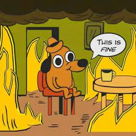

image: 

what to make for dinner | what to do today | colors I like
------------------------|------------------|----------------
chicken pasta           | make bed         | green
arros con habichuelas   | do laundry       | blue
pesto with skrimps      | oil hair         | lavender
steamed fish            | fold clothes     | orange
chop up                 | paint nails      | brown

Sometimes I think that I *really* like silver, but then I realize I really like **gold**.   
However, when I think about the type of *jewelry* I **buy**, I end up *buying* silver.   
**Next** time, I **will** buy gold.   

###### B words I like   
* boo    
* bump     
* bow    
* bubble    

###### pastries I like    
1. croissants   
2. cookies    
3. guava rolls     
4. brownies      

[My favorite song today](https://youtu.be/vGQ7ujVecLw)

## I love waffles superscript^yum^

### I like fries

#### I sort of like cheese

##### I do not like pickles ~ew~

inline equation: $B ^{2} = a^{2}-c^{2}$

`colors are the characters of the visual world`

