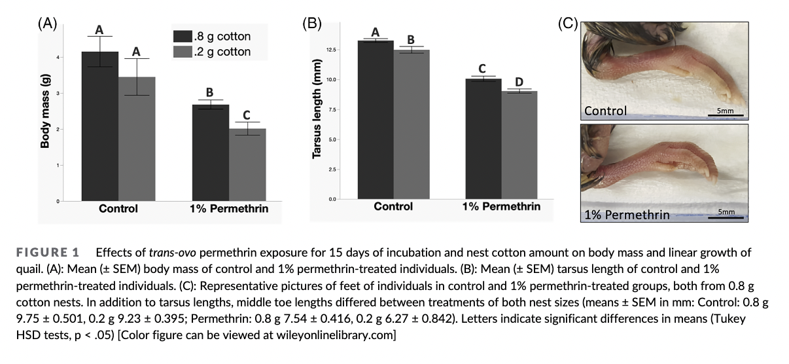
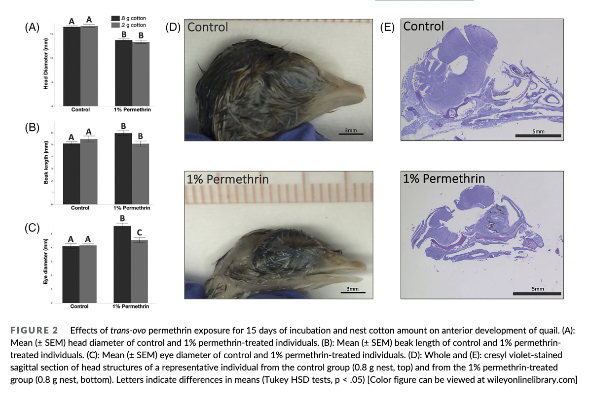
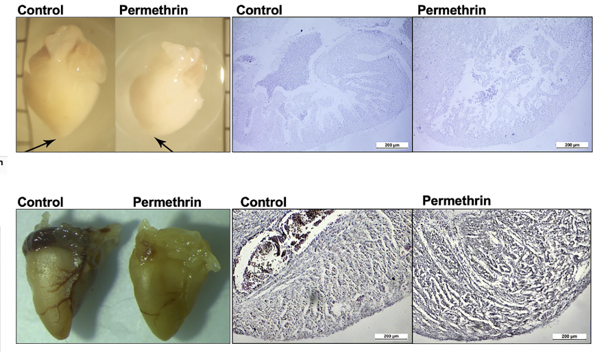

Intro:   
Hi and welcome to my final project presentation. Below I will build graphs to replicate that of a scientific report published by Erica Crespi of Washington State University. The report is about the widespread issue of highly effective but detrimental pesticides among quails. They are looking at ways to protect the Galapagos finches from invasive parasites. 

Initially, my plan was to make a personal website detailing the movies that I had watched during j-term and ranking them accordingly, but that proved to be quite difficult. Since I could only start on the final project post our class on Tuesday I was not able to get any troubleshooting help, so I decided making graphs was the next best thing. 

Step 1: obtain the data  
  1. Download the data set from datadryad.org. I used this website for the beak data: https://datadryad.org/stash/dataset/doi:10.5061%2Fdryad.2bvq83bs3     
  2. Click the link provided that will guide you to orchid.org to find the report figures.
  - insert pic
  3. Under works you will find title that relates to pecking and beaks. Click the DOI code.
  - insert pic
  4. Now that you have open access to the article, you can scroll a bit down and clock browse figure. This will show you all the figures within the article so you know what to copy. Take screenshots of the pictures so you can refer back to them as you work on the graph replication.
  
Step 2: Upload your data:
  1. 

```{r}
library(ggplot2)
library(ggthemes)
library(patchwork)
library(plyr)

Quail1<- read.table(file="final project/Trans-ovo quail 15.csv", header = TRUE, sep = ",")
head(Quail1)

Quail2<- read.table(file="final project/Trans-ovo qual 5.csv", header = TRUE, sep = ",")
head(Quail2)

```

  
Step 3: Figure 1
Here is a picture of my intended replication:



```{r}
### Making graph 1
###### looking at my data given in the form of a data frame I labeled Quail1, I can see that the first graph in  figure 1 uses columns: Treatment and Mass. I know this because the while the treatment column matches the permethrin column in Quail1, the categorizing column (nest weight in cotton) is only present in Quail2 for both .8g and .2g. 

#making my SEM bars
#data_summary <- function(data, varname, groupnames){
 # require(plyr)
#  summary_func <- function(x, col){
#    c(mean = mean(x[[col]], na.rm=TRUE),
#      sd = sd(x[[col]], na.rm=TRUE))
#  }
 # data_sum<-ddply(data, groupnames, .fun=summary_func,
   #               varname)
 # data_sum <- rename(data_sum, c("mean" = varname))
# return(data_sum)
#}

#df2 <- data_summary(Quail1, varname="Mass..g.", 
        #            groupnames=c("Permethrin", "Nest"))
# Convert Nest to a factor variable
#df2$Nest=as.factor(df2$Nest)
#head(df2)
# reverse order of legend
#df2$Nest <- factor(df2$Nest, levels = rev(levels(df2$Nest)))
#labels for legend
L <- c("A","A","B","C")
l1<- c(5,4,3,2.5)
#make the graph
graph1<- ggplot(data=Quail1,
              aes(x= Permethrin, y=Mass..g., fill=Nest)) + geom_bar(position="dodge", stat="identity", width=0.5) +
  ylab("Body mass(g)") +
  xlab("")+
  labs( tag= "(A)")
  #stat_summary(fun.data = mean_se, 
               #geom="errorbar",
               #width = 0.2)
graph1 + theme_classic() + scale_fill_grey( start = .1, end = .3, breaks = c("0.2 g cotton", "0.8 g cotton")) + guides(fill=guide_legend(title=""),) +
  theme(axis.text = element_text(face="bold"), panel.background = element_rect(fill = 'gray94', color = 'black'),
  legend.position="left") 
summarize
```

```{r}
### Making graph 2
###### looking at my data given in the form of a data frame I labeled Quail1, I can see that the first graph in  figure 1 uses columns: Treatment and Right.Tarsus. I know this because the while the treatment column matches the Permethrin column in Quail2, the dependent column (Tarsus length) is only present in Quail1. 
#reverse the legend
Quail1$Nest <- factor(Quail1$Nest, levels = rev(levels(Quail1$Nest)))
#make the graph
graph2<- ggplot(data=Quail1,
              aes(x= Permethrin, y=Right.Tarsus..mm., fill=Nest)) + geom_bar(position="dodge", stat="identity", width=0.5) +
  ylab("Tarsus Length (mm)") +
  xlab("") +
  labs( tag="(B)")
graph2 + theme_classic() + scale_fill_grey( start = .1, end = .3, breaks = c("0.2 g cotton", "0.8 g cotton")) + guides(fill=guide_legend(title=""),) +
  theme(axis.text = element_text(face="bold"), panel.background = element_rect(fill = 'gray94', color = 'black'),
  legend.position="left")


```


Step 4: Figure 2
Here is a picture of my intended replication:

Step 5: Figure 3
Here is a picture of my intended replication:


Step 6: Figure 4
Here is a picture of my intended replication:


Step 10: Plausible troubleshooting: