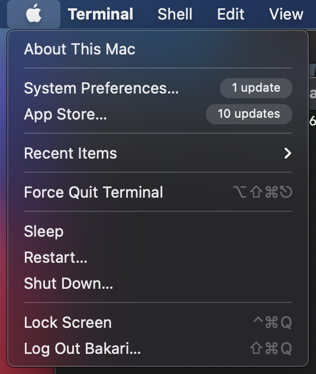
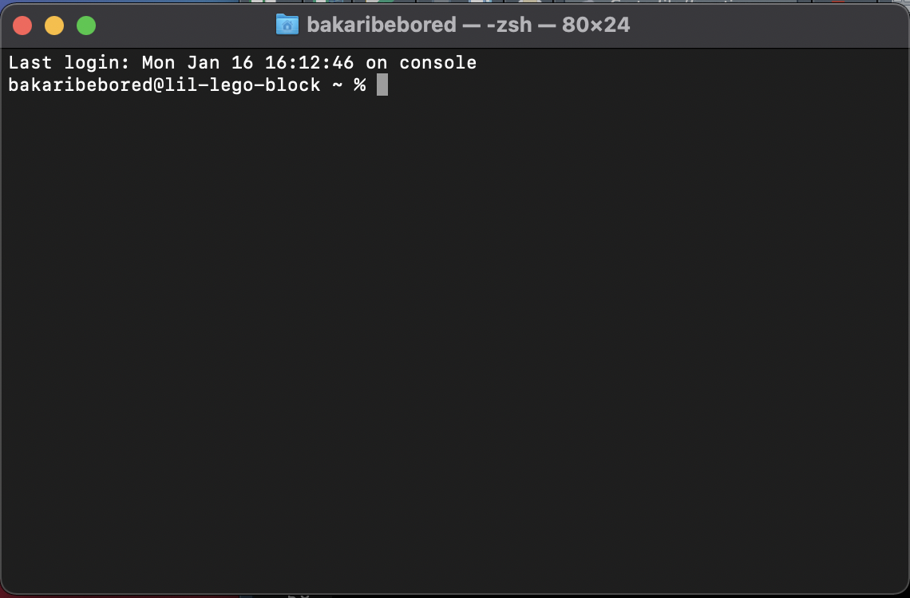

# How to Set Up a GitHub Webpage in RStudio

###### Step 1: Make a Github account    

  1. Open Github.com on a web browser (I used Google).    
  2. Click sign up for github and make a login.   
  
###### Step 2: Download R & R Studio   

  1. Go to: posit.co/download/rstudio-desktop/   
  2. Follow steps for install R and RStudio. Ensure that you click "Download RStudio for MAC if you have a MAC" or "Download RStudio for Windows" if you have a Windows    
  
###### Step 3. Set up RStudio
  1. Open R studio and select the Terminal.   
  2. Go to a server and open this website: https://yihui.org/tinytex/. scroll down until you find the install code: 'install.packages('tinytex')'. 
  3. Copy and paste the install code into the terminal area on R studio.   
  4. Install Rmarkdown in the terminal of Rstudio as well.    
  5. Copy this code: 'install.packages("rmarkdown")' and paste it into Terminal.   
  
###### Step 4: Create a repository in Github  

  1. Open Github and click repositories (you will find Repositories in a bar area below 'edit profile'). There you will find a button that says 'create a new repository'. Click it.   
  2. Name your repository.   
  3. Make sure it is set to public.  
  4. Add a ReadME file (this is where you can give your project a description).   
  5. Choose a licence. It is best to click MIT licence if you are not familiar with the other ones. This licence is just a basic licence that prevents people from stealing your data and profiting off of it.  
  6. Click create repository. You should be able to see the repository on the front page.   
  
###### Step 5: retrieve access code

  1. Go to settings and click developer settings.    
  2. Click personal access token.    
  3. Select Tokens Classic (it will ask you to put in your github account password).  
  4. Put a note so you know what the token is for.
  5. Adjust expiration date (it is a good idea to put at least a year).   
  6. For scopes click 'repo' (it will automatically click everything else under 'repo'.)
  7. Press generate token. Then copy down the code and put it somewhere you can't lose it. You should also email it to yourself to be safe. (github WILL NOT give you the code again)
  
###### Step 6: Install XCode

  1. You may run into some problems installing git through homebrew so installing XCode first may help. XCode is a binary package to help install Git.    
  2. To figure out which version of Mac you have, you can click the apple icon in the uppermost left corner of your laptop and select 'about this Mac'.   
  This is the icon:  {width=40%}  
  3. If you have the newest version of a Mac, you can download xcode from the apple store. 
  4. If you have version 12.5 or higher Mac, you can install Xcode from the apple store. If you have a lower version, you can find versions of Xcode fitted for your laptop at 'Xcodereleases.com'.   
       - It will request your Apple ID and password. Put those in and then install.
  
###### Step 7: Use Homebrew to install Git

  1. Go to 'https://formulae.brew.sh/formula/git' and copy the homebrew download link they provide.   
  2. Open terminal on your local computer. You can do so by clicking the search icon in the top right corner of your screen. Then, search Terminal and this should automatically open up the terminal.   
  3. Paste the homebrew download link into the terminal and wait for install.
  4. Go back to the homebrew git install page and then copy the install command for git. 
  5. Open Rstudio and click Terminal. Paste the Git install command into terminal and press enter. This should install git.   
A picture of what the local laptop terminal looks like: {width=40%}
  
###### Step 8: Link repository to Rstudio

  1. On Rstudio, there will be an icon in the upper right hand corner; there you will click 'new project'.   
  2. Then you will select version control and choose Git.
  3. It will prompt you to paste a URL. You will paste the repository URL saved from Step 5.7. 
  4. Name the project as you see fit.
  5. Select create project.
  
###### Step 9: Making the webpage
  1. Out final step is to make a webpage where we can add documents, forms, pictures etc.    
  2. First press the +document icon in the upper left corner and click Rmarkdown file. The title of the file can be whatever you like it to be.     
  3. In the author area, you can put your name.     
  4. If you wanted to make the webpage pretty, you can use a package called pretty doc.      
      1. Copy the following link: 'install.packages("prettydoc")' and paste it into the console of RStudio.    
      2. This will install the options that comes with it. You can go to this website to find the different versions: https://prettydoc.statr.me/themes.html.   
      3. In the Yaml ( this is the area where you see information such as author, title, etc), delete: 'html_document' from the output section. Then, put :html_pretty:.  
      4. Press enter, tab, and then type theme: (whatever theme you choose). Press enter again and type 'highlight: github'.   
  5. Knit the file and save the file. Once you press save you will have to name the file 'index'. This will be the main page of your website. Here you can put links to sub-pages and everything else you would like to add.
  
###### Step 10: Sending To Github.
  1. Now that your file is complete, in the terminal of RStudio, type 'git status' and press enter.   
      - Git status displays the state of the working directory and the staging area. It basically lets you see what changes have been made in your local file.   
  2. Type 'git add -A' and press enter.   
      - Git add -A adds all the modified and untracked files into the repository temporarily. Basically placing them there until you confirm you want them to stay there.   
  3. Type 'git commit -am"comment" and press enter.  
      - Git commit-am says to the repository that you intend to commit the changes made on your local version of the document to the public online document. 
      - "comment" is an area where you can label changes made to document online that you have committed to.
  4. Type 'git push' and press enter.
      - Git push will send these changes that you have committed to to the online repository permanently until you make changes again.
      
#### Thats all for now. Good Luck!

  
  

  

