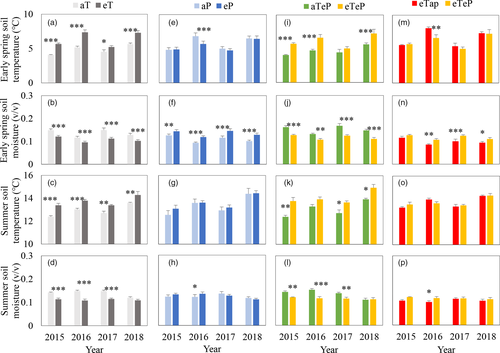

I am recreating a graph from a data set looking at the asymmetric of terrestrial high-latitude plant warming patterns are much more intense and asymmetric now than in the past.   



```{r}

TP1<- read.table(file="ww_data1.csv", header = TRUE, sep = ",")
head(TP1)
TP2<- read.table(file="ww_data2.csv", header = TRUE, sep = ",")
head(TP2)
```

