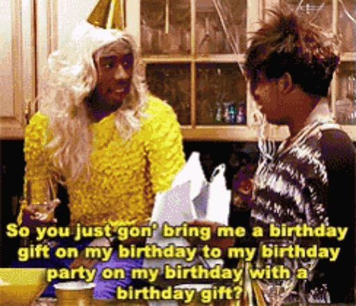

# Welcome   
 Hey y'all. Thanks for stopping by my page for a little minute. This is my first ever webpage made for my 23' J-term course: Reproducible in R. We're learning how to maneuver the statistical program R/Rstudio. This page serves as a culmination of my work throughout the pseudo-semester. Enjoy:) 

#### Laugh a little

## Daily Assignments
[Assignment 1](Assignment-1.html) 

[Assignment 2](Assignment-2.html)   

[Assignment 3](Assignment-3.html) 

[Assignment 4](Assignment-4.html)

[Assignment 5](Assignment-5.html)

[Assignment 6](Assignment-6.html)

[Assignment 7](Assignment-7.html)

[Assignment 8](Assignment-8.html)

## Weekly Assignments

[Weekly Assignment 1](Weekly-Assignment-1.html) 

[Weekly Assignment 2](Weekly-Assignment-2.html)

[Weekly Assignment 3](Weekly-Assignment-3.html)

